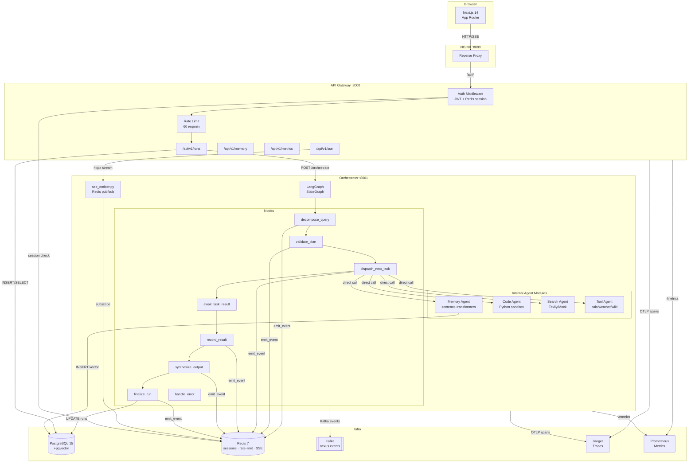

# NEXUS

**Distributed AI Agent Orchestration Platform**

[](https://python.org)
[](https://fastapi.tiangolo.com)
[](https://nextjs.org)
[](https://langchain-ai.github.io/langgraph/)
[](https://github.com/pgvector/pgvector)
[](https://redis.io)
[](https://kafka.apache.org)
[](https://docs.docker.com/compose/)

NEXUS lets users submit a natural-language query and watch in real time as specialized AI agents — Search, Code, Memory, and Tool — collaborate to answer it. A LangGraph-powered Orchestrator decomposes the query, dispatches tasks, and synthesizes a final answer while streaming every thought to the browser via SSE.

---

## Live Demo

<iframe 
    width="800" 
    height="450"
    src="https://www.youtube.com/embed/BrcfatovUzE"
    frameborder="0"
    allowfullscreen>
</iframe>

---


## Architecture



For a detailed prose description of each component, see [docs/architecture.md](docs/architecture.md).

### System Design

The system is split into two deployed services (see [ADR-005](docs/decisions/ADR-005-railway.md)):

- **API Gateway** (`services/gateway/`) — authentication, rate limiting, routing, SSE proxy
- **Orchestrator** (`services/orchestrator/`) — LangGraph state machine + all four agent implementations as internal Python modules

All four agents (Search, Code, Memory, Tool) live inside the Orchestrator process and are called as direct Python function calls from `nodes/dispatch_next_task.py`. This is a deliberate architectural trade-off documented in ADR-005.

---

## Tech Stack

| Layer | Technology |
|---|---|
| Frontend | Next.js 14 App Router, TypeScript, TailwindCSS, SWR, Recharts |
| API Gateway | FastAPI 0.111, Python 3.11, asyncpg, SQLAlchemy 2.0 async |
| Orchestration | LangGraph 0.1, Anthropic Claude claude-sonnet-4-20250514 |
| Search Agent | Tavily API (mock fallback), Redis LLM cache |
| Code Agent | asyncio subprocess sandbox, Claude tool use |
| Memory Agent | sentence-transformers all-MiniLM-L6-v2, pgvector cosine ANN |
| Tool Agent | Claude function calling → calculator / open-meteo / Wikipedia |
| Database | PostgreSQL 15 + pgvector extension |
| Cache / Sessions | Redis 7 |
| Streaming | Server-Sent Events, Redis pub/sub |
| Message Queue | Apache Kafka (Confluent), aiokafka |
| Observability | OpenTelemetry + Jaeger, structlog JSON, Prometheus |
| Infrastructure | Docker Compose v2, NGINX reverse proxy |
| Deployment | Railway (backend), Vercel (frontend) |

---

## Quick Start

> **Prerequisites:** Docker Desktop 4.25+, Python 3.11 (pyenv), Node 20 (nvm), PowerShell 7 (Windows)

### 1 — Clone and configure

```powershell
git clone https://github.com/<your-handle>/nexus.git
cd nexus
Copy-Item .env.example .env
# Edit .env: set POSTGRES_PASSWORD, REDIS_PASSWORD, ANTHROPIC_API_KEY (or GEMINI_API_KEY), JWT_SECRET_KEY
notepad .env
```

### 2 — Start infrastructure

```powershell
.\scripts\start-infra.ps1
```

Starts PostgreSQL, Redis, Kafka, Zookeeper, NGINX, Jaeger, and Prometheus. Waits for all health checks to pass and creates Kafka topics.

### 3 — Seed the database

```powershell
Copy-Item db\.env.example db\.env
# Edit db\.env: set DATABASE_URL_LOCAL=postgresql+asyncpg://nexus:<password>@localhost:5434/nexus_db
notepad db\.env
.\scripts\seed-db.ps1
```

Inserts 10 users, 4 agent definitions, 50 runs, and 200 tasks.

### 4 — Start application services

```powershell
.\scripts\start-all-services.ps1
```

Builds and starts the Gateway (port 8000) and Orchestrator (port 8001).

### 5 — Start the frontend

```powershell
cd frontend
Copy-Item .env.local.example .env.local
npm install
npm run dev
```

Open [http://localhost:3000](http://localhost:3000). Register an account, submit a query, watch the thought trace.

---

## Architecture Decision Records

| ADR | Decision |
|---|---|
| [ADR-001](docs/decisions/ADR-001-langgraph.md) | LangGraph over CrewAI for agent orchestration |
| [ADR-002](docs/decisions/ADR-002-pgvector.md) | pgvector over Pinecone for vector storage |
| [ADR-003](docs/decisions/ADR-003-sse-vs-websocket.md) | SSE over WebSockets for real-time streaming |
| [ADR-004](docs/decisions/ADR-004-kafka-topics.md) | Kafka topic design (3 topics, partition strategy) |
| [ADR-005](docs/decisions/ADR-005-railway.md) | Railway deployment + microservices → hybrid monolith migration |

---

## Project Structure

```text
nexus/
├── services/
│   ├── _archived/        # All agents microservices (see ADR-005)
│   ├── gateway/          # API Gateway (FastAPI)
│   ├── orchestrator/     # Orchestrator + all agents (LangGraph + FastAPI)
│   │   └── agents/       # Search, Code, Memory, Tool agent modules
│   └── shared/           # Shared Python modules (logging, metrics, kafka)
├── frontend/             # Next.js 14 App Router
├── db/                   # PostgreSQL schema, migrations, seed script
├── infra/                # NGINX, Kafka, Prometheus configs
├── docs/
│   ├── architecture.md
│   └── decisions/        # ADR-001 through ADR-005
└── scripts/              # PowerShell automation (Windows)
```

---

## Running Tests

```powershell
.\scripts\test-all.ps1
```

Runs: infrastructure integration tests, DB schema tests (pytest-asyncio), gateway unit tests, orchestrator node unit tests.

---

## Screenshots


---

## License

MIT — see [LICENSE](LICENSE).