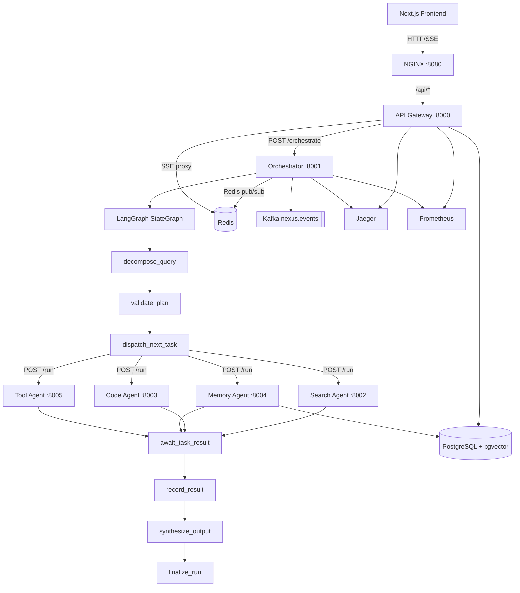

# NEXUS Architecture

## Overview

NEXUS is a distributed AI agent orchestration platform. A user submits a natural-language query via the Next.js frontend. The API Gateway authenticates the request, creates a run record in PostgreSQL, and dispatches it asynchronously to the Orchestrator. The Orchestrator uses LangGraph to decompose the query into a structured task plan, then executes each task by calling the appropriate agent service over HTTP. As the run progresses, events are published to Redis pub/sub and streamed to the browser via Server-Sent Events.

## Services

### API Gateway (`services/gateway/` — port 8000)

Single ingress point for all frontend traffic. Responsibilities:
- JWT authentication via `middleware/auth.py` (Bearer token validated against Redis session store)
- Redis-backed fixed-window rate limiting via `middleware/rate_limit.py`
- Run lifecycle endpoints (`routers/runs.py`): POST to create, GET to list/fetch
- SSE proxy (`routers/sse.py`): proxies the Orchestrator's per-run event stream to the browser
- Memory endpoints (`routers/memory.py`): proxies to Orchestrator memory router
- Metrics endpoints (`routers/metrics.py`): per-user aggregated statistics from PostgreSQL

### Orchestrator (`services/orchestrator/` — port 8001)

The brain of NEXUS. Receives a `POST /orchestrate` call from the Gateway and runs the LangGraph state machine asynchronously. The `dispatch_next_task` node resolves the correct agent URL from configuration and sends a `POST /run` request to the target service.

The Orchestrator also exposes:
- `GET /runs/{run_id}/stream`: SSE endpoint that streams Redis pub/sub events to the Gateway
- `GET /memory/search` and `GET /memory`: memory read endpoints called by the Gateway memory router

### Agent Services

- **Search Agent** (`services/search_agent/` — port 8002): query formulation, Tavily/mock web search, re-rank, and summarize
- **Code Agent** (`services/code_agent/` — port 8003): iterative generate-execute-debug loop using an `asyncio` subprocess sandbox
- **Memory Agent** (`services/memory_agent/` — port 8004): SentenceTransformer embeddings and pgvector cosine similarity search
- **Tool Agent** (`services/tool_agent/` — port 8005): tool dispatch for calculator, weather, and Wikipedia

### LangGraph State Machine (`graph.py`)

The graph is built once at startup. Nodes return partial state updates, and LangGraph merges them into `OrchestratorState`.

| Node | Role |
|---|---|
| `decompose_query` | Build the initial task plan from the user's query |
| `validate_plan` | Validate task shape and route invalid plans to error handling |
| `dispatch_next_task` | Select the next incomplete task and call the matching agent service |
| `await_task_result` | Normalize the agent response stored on the pending task |
| `record_result` | Persist task output and append it to completed tasks |
| `synthesize_output` | Combine completed task results into the final answer |
| `finalize_run` | Update run status, metrics, and terminal events |
| `handle_error` | Retry recoverable failures or mark the run failed |

## Data Stores and Infra

- **PostgreSQL 15 + pgvector** stores users, runs, tasks, events, and memory embeddings.
- **Redis 7** stores JWT sessions, rate-limit counters, SSE replay buffers, and pub/sub channels.
- **Kafka** is provisioned for learning and event-contract practice. Runtime dispatch currently uses HTTP; `nexus.events` remains the useful topic for event publication experiments.
- **NGINX** exposes the local API through `localhost:8080`.
- **Jaeger and Prometheus** support tracing and metrics during local development.

## Runtime Flow

1. The frontend posts a query to `POST /api/v1/runs`.
2. The Gateway validates the JWT/session, rate-limits the user, inserts a run row, and calls `POST /orchestrate`.
3. The Orchestrator decomposes the query into tasks and dispatches each task to the configured agent service.
4. Agent services return task results synchronously to the Orchestrator.
5. Orchestrator nodes emit Redis pub/sub events as the run advances.
6. The Gateway SSE endpoint streams those events to the browser.
7. The final answer and run metadata are persisted in PostgreSQL.
